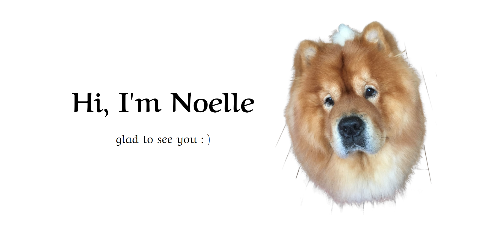

### Hey, nice to meet you here 

- 💻 I am currently learning Web Development at <a href="https://tw.alphacamp.co/" target="_blank">ALPHA Camp</a>.
- 📖 Recently focused on practicing coding and learning English.
- 💡 Enjoy and get excited about daily challenges, practice makes perfect.
- ✨ Except for code, I also love animals (especially dogs), coffee, and psychology.
- 😄 It's my dog in the photo. I am always missing and loving him.
- 🎓 I Hope can become an engineer in 2023.

---

### Languages and Tools

 
 
 
 

<!--
**Noelle-KH/Noelle-KH** is a ✨ _special_ ✨ repository because its `README.md` (this file) appears on your GitHub profile.

Here are some ideas to get you started:

- 🔭 I’m currently working on ...
- 🌱 I’m currently learning ...
- 👯 I’m looking to collaborate on ...
- 🤔 I’m looking for help with ...
- 💬 Ask me about ...
- 📫 How to reach me: ...
- 😄 Pronouns: ...
- ⚡ Fun fact: ...
-->
